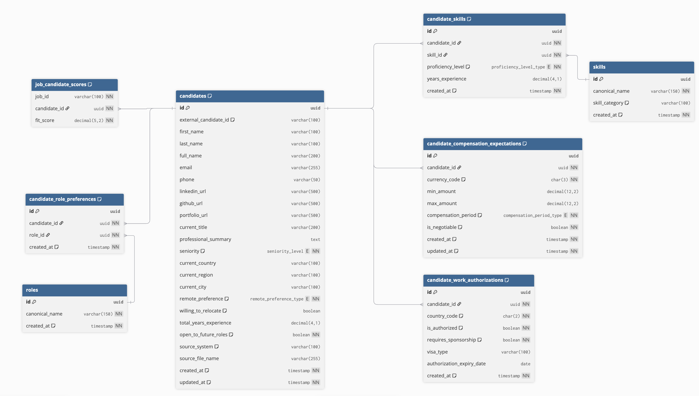

# Talent Schema

In this schema design I have prioritized the **candidates** by assigning table to them and created relational tables to keep the required informations such as;
- Skills
- Compensation Expectations
- Work Authorization
- Role Preferences

The table explanations are as the followings.
### Candidates
This table primarily focuses on the general information about the candidates. It includes Fullname and contact information and also digital informations like; LinkedIn, GitHub and portfolio URLS.
It also includes geological informations like; Country, City and Region
Job intents like Remote Preference, Willing to Relocate and Total Years of Experince is also stored in this table.
There is an boolean column called **open_to_future_roles**. It is included intentionally on; if the value is **True** for a candidate_id, the Recruite can also include him/her if the skills are match for the position even if the candidate did not apply the position himself/herself. Lastly the table includes source_system as the source of the application and source_file_name for source file name like CV's or cover letters.

To enrich the candidate's profile in the aspect of the job applications, I created seperated tables. 

### Candidate Work Authorization
In this table, every candidate id is being stored and it stores the country code and authorization status for that country. Includes wheter the candidate requires a sponsorship, visa type and the experation date of the autharization. The intention to create a seperate table like this is that; if the job is not including any sponsorship or requires an authorization to work, a SQL query will filter the candidate id's that are not eligible to consider for that particular job. Storing these kind of information in a seperate table so that the main table will kept simple and keep deduplication records. 

### Candidate Compensation Expectation
This table keeps the expectation for each candidates. Includes candidate_id, currency_code, min/max amount, compensation period and whether candidate is open to negotiation. With this table I aimed to keep things simple because in real world expecting a salary range x for particular job and expecting another range y for another job is not a realistic scneario. Every candidates expectations are kept in single table, so recruiter can filter out candidates with unrealistic expectations. 

### Candidate Skills
This is where the schema begins to talk. It is connected to another table called **skills**. In the skills table, the recruiter keeps the skillsets with the actual name of the skill that recruiter will work with and the corresponding category. The category column is useful by filtering the required skills in one shot. At the main table **candidate_skills** we keep candidate_id, skill_id, proficiency level of that particular skill and years of experience. This table keeps every skill and their levels in single table and creates relation with every candidate which creates an oppurtunity to create meaningful data that represents what skills does the candidate have. 

### Candidate Role Preferences
This table is meaningful when the recruiter or the candidate defines a preference. It is connected to **roles** table which I kept simple for the sake of the demo, but generally it keeps all the information required for the roles and it is connected to **candidate_role_preferences** via role_id which they combined represents the information of the preferences for the roles that candidates selected. 

### Job Candidate Scores
I created this table for more realistic workflow logic. It basically includes the combination of:
- job id
- candidate id
- fit score

Which basically helps the recruiter to gather the final considerable candidates for any desired job. 

> 💡 _It is not asked to be designed but I tought that might be useful to explain better data schema._

## Complete Schema Manuel with Table - Column Formats

**Enum types**

* `seniority_level`: `intern`, `junior`, `mid`, `senior`, `staff`, `principal`, `executive`, `unknown`
* `remote_preference_type`: `remote`, `hybrid`, `onsite`, `flexible`, `unknown`
* `proficiency_level_type`: `beginner`, `intermediate`, `advanced`, `expert`, `unknown`
* `compensation_period_type`: `hourly`, `monthly`, `yearly`, `unknown`

>  _Can be enhanced via business-intent logic._

**candidates**

* `id` (`uuid`): primary key for each candidate
* `external_candidate_id` (`varchar(100)`): optional source-side candidate identifier
* `first_name`, `last_name` (`varchar(100)`): candidate first and last name
* `full_name` (`varchar(200)`): full candidate name
* `email` (`varchar(255)`): email address
* `phone` (`varchar(50)`): phone number
* `linkedin_url`, `github_url`, `portfolio_url` (`varchar(500)`): profile links
* `current_title` (`varchar(200)`): current job title
* `professional_summary` (`text`): free-text summary
* `seniority` (`seniority_level`): candidate seniority level
* `current_country`, `current_region`, `current_city` (`varchar(100)`): current location fields
* `remote_preference` (`remote_preference_type`): preferred working model
* `willing_to_relocate` (`boolean`): whether the candidate is open to relocation
* `total_years_experience` (`decimal(4,1)`): total years of experience
* `open_to_future_roles` (`boolean`): whether the candidate is open to future opportunities
* `source_system` (`varchar(100)`): source of uploaded data, such as LinkedIn export, ATS export, or CSV upload
* `source_file_name` (`varchar(255)`): uploaded file name
* `created_at`, `updated_at` (`timestamp`): record creation and update timestamps

**skills**

* `id` (`uuid`): primary key for each skill
* `canonical_name` (`varchar(150)`): normalized skill name, such as Python, SQL, Airflow
* `skill_category` (`varchar(100)`): broad skill group, for example programming language, cloud, orchestration, ML, analytics
* `created_at` (`timestamp`): record creation time

**candidate_skills**

* `id` (`uuid`): primary key
* `candidate_id` (`uuid`): references `candidates.id`
* `skill_id` (`uuid`): references `skills.id`
* `proficiency_level` (`proficiency_level_type`): candidate’s level for that skill
* `years_experience` (`decimal(4,1)`): years of experience with that skill
* `created_at` (`timestamp`): record creation time

**candidate_compensation_expectations**

* `id` (`uuid`): primary key
* `candidate_id` (`uuid`): references `candidates.id`
* `currency_code` (`char(3)`): ISO currency code such as USD, EUR, TRY
* `min_amount`, `max_amount` (`decimal(12,2)`): expected compensation range
* `compensation_period` (`compensation_period_type`): hourly, monthly, yearly, or unknown
* `is_negotiable` (`boolean`): whether the compensation expectation is negotiable
* `created_at`, `updated_at` (`timestamp`): record creation and update timestamps

**candidate_work_authorizations**

* `id` (`uuid`): primary key
* `candidate_id` (`uuid`): references `candidates.id`
* `country_code` (`char(2)`): ISO country code such as US, DE, NL
* `is_authorized` (`boolean`): whether the candidate is authorized to work in that country
* `requires_sponsorship` (`boolean`): whether visa sponsorship is needed
* `visa_type` (`varchar(100)`): visa or permit type if applicable
* `authorization_expiry_date` (`date`): expiry date of the authorization if applicable
* `created_at` (`timestamp`): record creation time

**roles**

* `id` (`uuid`): primary key for each role
* `canonical_name` (`varchar(150)`): normalized role name, such as Data Engineer or ML Engineer
* `created_at` (`timestamp`): record creation time

**candidate_role_preferences**

* `id` (`uuid`): primary key
* `candidate_id` (`uuid`): references `candidates.id`
* `role_id` (`uuid`): references `roles.id`
* `created_at` (`timestamp`): record creation time

**job_candidate_scores**

* `job_id` (`varchar(100)`): job identifier
* `candidate_id` (`uuid`): references `candidates.id`
* `fit_score` (`decimal(5,2)`): computed fit score for a given job-candidate pair

> 💡 _DBML diagram code for the schema is provided for [live-action inspection](https://dbdiagram.io/d)_